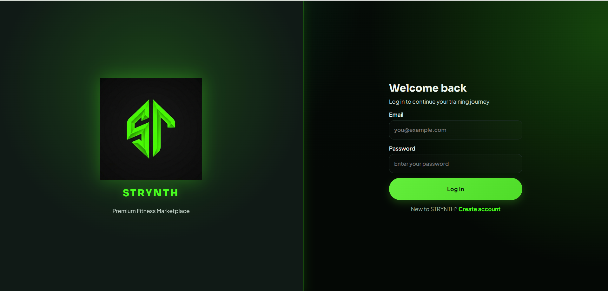
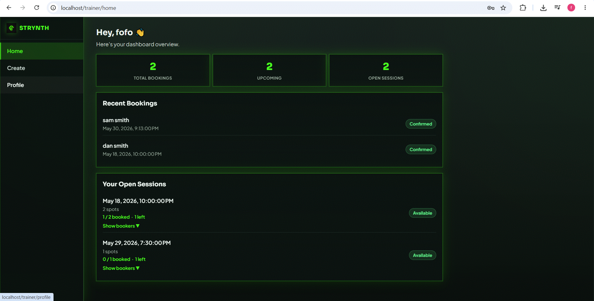
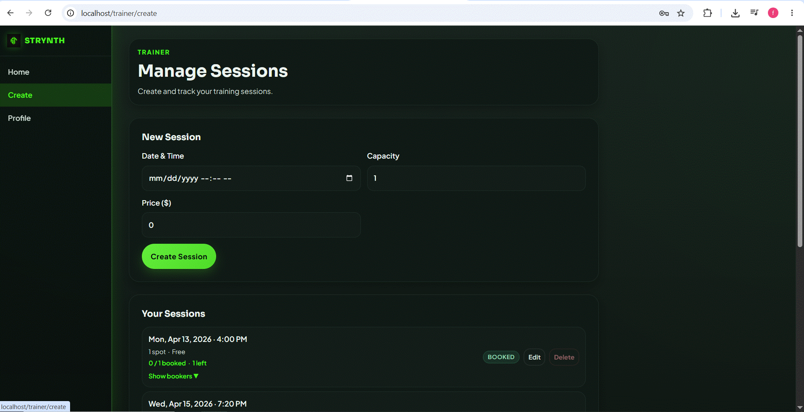
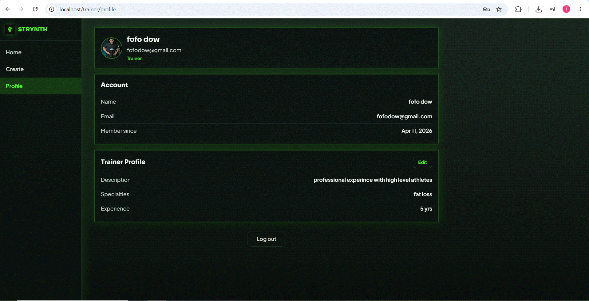
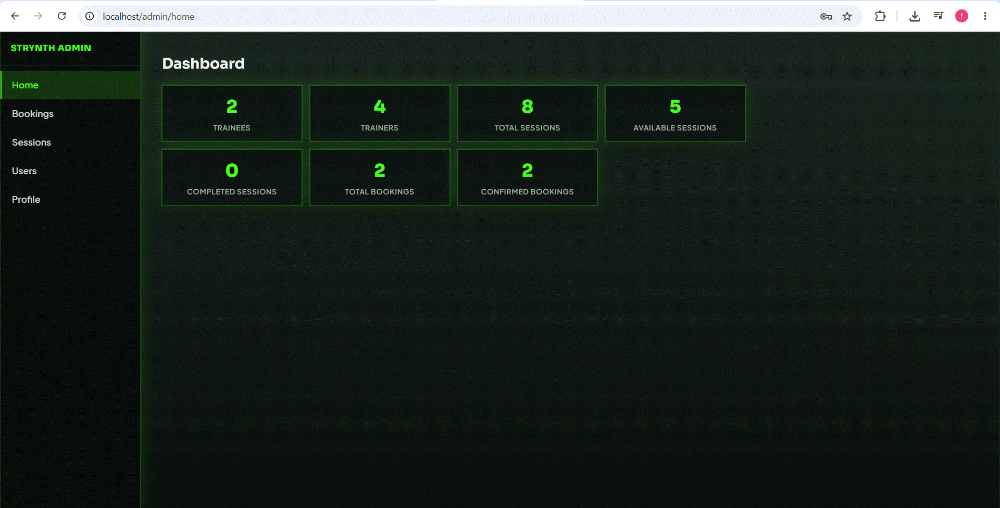
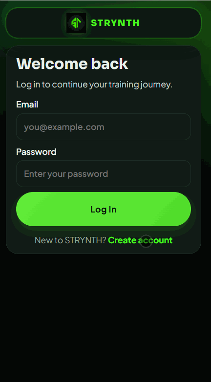

<div align="center">

# STRYNTH

**A full-stack fitness booking platform built with Angular, Node.js, and MySQL**

[](https://angular.io)
[](https://nodejs.org)
[](https://expressjs.com)
[](https://mysql.com)
[](https://docker.com)
[](https://typescriptlang.org)

</div>

---

## Overview

STRYNTH is a production-ready fitness booking application that connects trainees with personal trainers. Trainees browse trainer profiles, select sessions, and complete a mock payment checkout — all in one seamless flow. Trainers manage their own session catalogue. Admins have full platform visibility.

The application is fully responsive and designed to work seamlessly on both mobile devices and desktop PCs.

The project demonstrates end-to-end full-stack engineering: a layered REST API, an Angular signals-based SPA, a containerised deployment with Docker Compose, and a dark neon design system built entirely from CSS custom properties.

---

## Live Demo

> Run locally in under two minutes with Docker — see [Getting Started](#getting-started).

```
Frontend   →  http://localhost
Backend    →  http://localhost:5000
Health     →  http://localhost:5000/health
```

---

## Features

### Trainee
- Browse and search all trainers with specialty filter chips
- View trainer bio, years of experience, and live available sessions with real-time spot counts
- Select a session and proceed to a full payment form with client-side card validation
- Atomic book-and-pay — the booking is only created if payment succeeds (no orphaned bookings)
- Post-payment confirmation page listing all confirmed bookings

### Trainer
- Create, edit, and delete training sessions (date/time, capacity, price)
- Automatic session status update to `booked` when all spots are filled
- View all confirmed bookings across their sessions
- Manage public profile (bio, specialties, years of experience, profile photo)

### Admin
- Platform-wide stats dashboard
- Full CRUD over users, sessions, and bookings
- Promote/demote user roles; edit any trainer's profile

### Platform
- JWT authentication with role-based access control (trainee / trainer / admin)
- Profile photo upload (JPEG, PNG, WebP — 5 MB limit) served as static files
- Fully containerised with Docker Compose — one command to run

---

## Screenshots & Demo

### Login Page

*Login — JWT authentication with role-based redirect*

### Trainer Dashboard

*Trainer home — booking stats and open sessions at a glance*

### Session Management

*Manage Sessions — create, edit, and delete training sessions*

### Trainer Profile

*Trainer Profile — manage bio, specialties, and profile photo*

### Admin Dashboard

*Admin Dashboard — platform-wide stats, full CRUD over users, sessions, and bookings*

### Desktop Booking Flow

*Desktop — full session booking flow*

### Mobile Booking Flow

*Mobile — full session booking flow on a narrow screen*

---

## Architecture

```
┌─────────────────────────────────┐      ┌──────────────────────────────────┐
│         Angular 21 SPA          │      │       Node.js / Express API       │
│                                 │      │                                   │
│  Signals · OnPush · Standalone  │      │  Controllers → Services →         │
│  Lazy-loaded routes             │ HTTP │  Repositories → MySQL             │
│  CSS custom-property theme      │◄────►│                                   │
│                                 │      │  JWT auth · bcrypt · multer       │
│  nginx (prod, port 80)          │      │  Atomic transactions (FOR UPDATE) │
└─────────────────────────────────┘      └──────────────────────────────────┘
                                                       │
                                              ┌────────┴────────┐
                                              │    MySQL 8      │
                                              │  (host machine) │
                                              └─────────────────┘
```

**Frontend** is a multi-stage Docker build: Angular CLI compiles to a static bundle, served by nginx which also reverse-proxies `/api/` and `/uploads/` to the backend.

**Backend** follows a strict layered architecture: routes → controllers → services → repositories. No SQL outside the `repositories/` layer.

---

## Tech Stack

| | Frontend | Backend |
|--|----------|---------|
| **Language** | TypeScript 5.9 | JavaScript (ESM) |
| **Framework** | Angular 21 | Express 5 |
| **State** | Angular Signals | — |
| **Database** | — | MySQL 8 (`mysql2`) |
| **Auth** | JWT (interceptor) | `jsonwebtoken` + `bcrypt` |
| **Styling** | SCSS / CSS custom properties | — |
| **Container** | nginx 1.27-alpine | node:22-alpine |
| **Build** | Angular CLI | — |

---

## Project Structure

```
/
├── docker-compose.yml
├── .env                          ← DB credentials + JWT secret (not committed)
│
├── STRYNTH Back-end/
│   ├── src/
│   │   ├── app.js                ← Express app, CORS, routes, error handler
│   │   ├── server.js             ← Entry point
│   │   ├── config/db.js          ← MySQL connection pool
│   │   ├── controllers/          ← HTTP layer
│   │   ├── services/             ← Business logic + validation
│   │   ├── repositories/         ← All SQL queries
│   │   ├── middleware/           ← JWT auth, multer upload, error handler
│   │   └── utils/serviceHelpers.js
│   ├── database/schema.mysql.sql
│   └── uploads/profile-images/
│
└── STRYNTH front-end/
    ├── src/app/
    │   ├── core/                 ← Guards, interceptor, API service, auth service
    │   ├── features/             ← trainee | trainer | admin | checkout | sessions
    │   └── shared/               ← Reusable UI component library
    ├── src/styles/               ← Design token system (SCSS)
    ├── nginx.conf
    └── Dockerfile                ← Multi-stage build
```

---

## Getting Started

### Prerequisites

- [Docker Desktop](https://www.docker.com/products/docker-desktop/) (Windows / macOS / Linux)

### 1 — Clone and copy the environment file

```bash
git clone https://github.com/fadibittar4-hub/fitness-app.git
cd fitness-app
cp .env.example .env
```

The `.env.example` already contains working defaults — no editing needed.

### 2 — Start the stack

```bash
docker compose up --build -d
```

That's it. Docker pulls MySQL 8, applies the schema automatically, builds the Angular app and the Node.js API, and starts everything.

| Service | URL |
|---------|-----|
| Frontend (nginx) | http://localhost |
| Backend API | http://localhost:5000 |
| Health check | http://localhost:5000/health |

### 3 — Stop

```bash
docker compose down
```

---

## API Highlights

### Atomic Book-and-Pay

The most technically interesting endpoint — a single HTTP call that:

1. Acquires a `SELECT … FOR UPDATE` row lock on the session
2. Validates session availability and capacity
3. Runs a mock payment (any method except `fail`/`declined` succeeds)
4. Inserts both the `booking` and `payment` records atomically
5. Auto-updates session status to `booked` when capacity is reached

If two users simultaneously book the last spot, only one transaction commits. The other receives a `409 Session is fully booked` error.

```http
POST /api/v1/bookings/pay
Authorization: Bearer <token>
Content-Type: application/json

{
  "session_id": 10,
  "amount": 49.99,
  "payment_method": "card"
}
```

---

## Design System

The frontend uses a single dark neon theme built entirely on CSS custom properties — no hardcoded hex values in component files.

Token categories: `--color-bg`, `--color-surface`, `--color-primary` (neon green), `--color-text-*`, `--color-border-*`, `--space-1…8`, `--radius-*`, `--shadow-*`, `--text-xs…2xl`.

All shared UI components live in `src/app/shared/components/ui/` and are consumed across feature pages without coupling.

---

## Role-Based Access

| Role | Can do |
|------|--------|
| `trainee` | Browse trainers, book sessions, view own bookings |
| `trainer` | All of the above + manage own sessions + view own bookings |
| `admin` | Full read/write access to all users, sessions, and bookings |

Route guards (`traineeGuard`, `trainerGuard`, `adminGuard`) enforce role separation at the Angular router level. The backend independently enforces roles on every protected endpoint.

---

## Security Notes

- Passwords hashed with `bcrypt` (never stored in plain text)
- JWT tokens signed with a configurable secret (`JWT_SECRET` env var)
- SQL injection prevented — all queries use parameterised placeholders via `mysql2`
- File uploads validated by MIME type and size before storage
- CORS restricted to known origins

---

## Documentation

| Document | Location |
|----------|----------|
| Backend technical reference | [`STRYNTH Back-end/README.md`](STRYNTH%20Back-end/README.md) |
| Frontend technical reference | [`STRYNTH front-end/README.md`](STRYNTH%20front-end/README.md) |
| Full API integration guide | [`STRYNTH Back-end/docs/frontend-api-integration.md`](STRYNTH%20Back-end/docs/frontend-api-integration.md) |
| Frontend architecture | [`STRYNTH front-end/docs/frontend-architecture.md`](STRYNTH%20front-end/docs/frontend-architecture.md) |
| Design system | [`STRYNTH front-end/docs/design-system.md`](STRYNTH%20front-end/docs/design-system.md) |

---

<div align="center">

Built end-to-end as a full-stack portfolio project.

</div>
